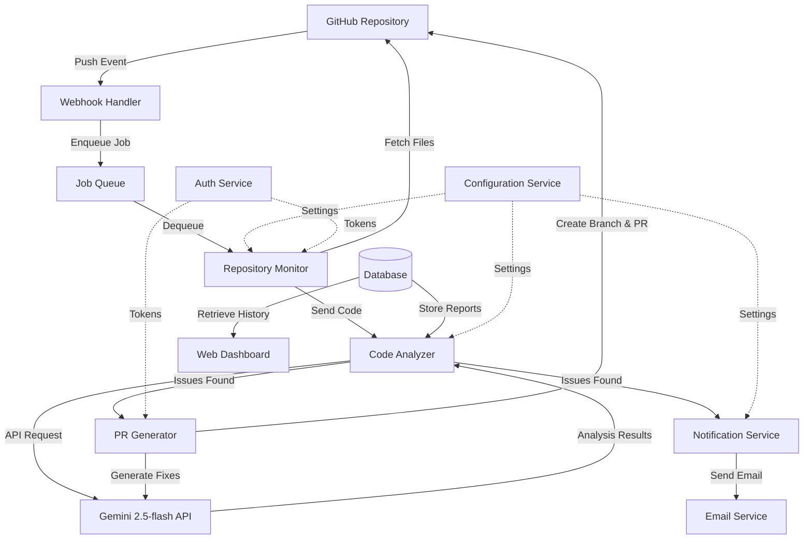

# Design Document: Automated Code Review System

## Overview

The Automated Code Review System (Code Police) is a cloud-based service that monitors GitHub repositories, analyzes code changes using AI, and automatically generates fixes through pull requests. The system operates as an event-driven architecture triggered by GitHub webhook push events.

The core workflow follows this sequence:
1. GitHub push event triggers webhook
2. System retrieves changed files and full context
3. Gemini 2.5-flash analyzes code for issues
4. Email notification sent to repository owner
5. AI generates fixes for identified issues
6. Pull request created with fixes and detailed report

Key design principles:
- **Event-driven architecture**: Webhook-based triggers for real-time response
- **Asynchronous processing**: Non-blocking analysis and PR generation
- **Idempotent operations**: Safe retry logic for all external API calls
- **Separation of concerns**: Independent components for monitoring, analysis, notification, and PR generation

## Architecture

### System Architecture Diagram



### Component Overview

**Webhook Handler**: Receives GitHub push events, validates signatures, enqueues analysis jobs
**Job Queue**: Manages asynchronous processing with retry logic (Redis/RabbitMQ)
**Repository Monitor**: Fetches changed files and dependencies from GitHub
**Code Analyzer**: Orchestrates AI analysis using Gemini 2.5-flash
**Notification Service**: Sends formatted email reports to repository owners
**PR Generator**: Creates branches, applies fixes, generates pull requests
**Configuration Service**: Manages repository settings and user preferences
**Auth Service**: Handles GitHub OAuth and API token management
**Database**: Stores analysis reports, configuration, and historical data
**Web Dashboard**: Provides UI for configuration and viewing analysis history

## Components and Interfaces

### 1. Webhook Handler

**Responsibility**: Receive and validate GitHub webhook events, enqueue analysis jobs

**Interface**:
```typescript
interface WebhookHandler {
  // Receive webhook POST request from GitHub
  handleWebhook(request: WebhookRequest): WebhookResponse
  
  // Validate webhook signature using secret
  validateSignature(payload: string, signature: string): boolean
  
  // Enqueue analysis job for processing
  enqueueJob(pushEvent: PushEvent): JobId
}

interface WebhookRequest {
  headers: Record<string, string>
  body: string
}

interface WebhookResponse {
  status: number
  message: string
}

interface PushEvent {
  repository: RepositoryInfo
  commits: Commit[]
  pusher: User
  ref: string  // branch reference
}
```

**Implementation Notes**:
- Validates webhook signature using HMAC-SHA256 with configured secret ([GitHub webhook security](https://docs.github.com/en/webhooks/using-webhooks/best-practices-for-using-webhooks))
- Returns 200 OK immediately to GitHub (within 10 seconds)
- Enqueues job to Redis/RabbitMQ for asynchronous processing
- Filters for push events only (ignores other event types)
- Logs all webhook receipts for debugging

### 2. Repository Monitor

**Responsibility**: Fetch changed files and their dependencies from GitHub

**Interface**:
```typescript
interface RepositoryMonitor {
  // Fetch all files changed in commits
  fetchChangedFiles(job: AnalysisJob): FileContent[]
  
  // Fetch file content at specific commit
  fetchFileContent(repo: string, path: string, sha: string): string
  
  // Parse and resolve import statements
  resolveImports(file: FileContent): ImportedFile[]
  
  // Build complete context including dependencies
  buildAnalysisContext(files: FileContent[]): AnalysisContext
}

interface AnalysisJob {
  jobId: string
  repository: RepositoryInfo
  commits: Commit[]
  branch: string
}

interface FileContent {
  path: string
  content: string
  language: string
  sha: string
}

interface AnalysisContext {
  changedFiles: FileContent[]
  importedFiles: FileContent[]
  commitInfo: CommitMetadata
}
```

**Implementation Notes**:
- Uses GitHub REST API to fetch file contents ([GitHub Contents API](https://docs.github.com/en/rest/repos/contents))
- Parses import statements based on language (JavaScript/TypeScript: import/require, Python: import/from, etc.)
- Recursively fetches imported files up to 2 levels deep (prevents excessive API calls)
- Caches file contents by SHA to avoid redundant fetches
- Handles binary files gracefully (skips analysis)
- Respects GitHub API rate limits (5000 requests/hour for authenticated requests)

### 3. Code Analyzer

**Responsibility**: Analyze code using Gemini 2.5-flash and generate issue reports

**Interface**:
```typescript
interface CodeAnalyzer {
  // Analyze code context and identify issues
  analyzeCode(context: AnalysisContext, config: AnalysisConfig): AnalysisReport
  
  // Call Gemini API with retry logic
  callGeminiAPI(prompt: string, code: string): GeminiResponse
  
  // Parse Gemini response into structured issues
  parseIssues(response: GeminiResponse): Issue[]
  
  // Store analysis report in database
  storeReport(report: AnalysisReport): ReportId
}

interface AnalysisConfig {
  severityThreshold: Severity
  ignoredPatterns: string[]
  analysisScope: AnalysisScope
  maxTokens: number
}

interface AnalysisReport {
  reportId: string
  repository: string
  branch: string
  commitSha: string
  timestamp: Date
  issues: Issue[]
  summary: ReportSummary
}

interface Issue {
  id: string
  severity: Severity  // critical, high, medium, low
  type: IssueType     // syntax, logic, security, style, performance
  file: string
  line: number
  column: number
  description: string
  suggestion: string
  fixable: boolean
}

enum Severity {
  CRITICAL = "critical",
  HIGH = "high",
  MEDIUM = "medium",
  LOW = "low"
}

enum IssueType {
  SYNTAX = "syntax",
  LOGIC = "logic",
  SECURITY = "security",
  STYLE = "style",
  PERFORMANCE = "performance"
}
```

**Implementation Notes**:
- Constructs detailed prompts for Gemini including:
  - Full file context with line numbers
  - Import statements and dependencies
  - Language-specific best practices
  - Request for structured JSON output
- Gemini 2.5-flash supports up to 1M input tokens ([Gemini long context](https://ai.google.dev/gemini-api/docs/long-context))
- Chunks large codebases if total tokens exceed 800K (leaves buffer for response)
- Implements exponential backoff retry (3 attempts with 1s, 2s, 4s delays)
- Parses Gemini JSON response into structured Issue objects
- Validates all required fields present in parsed issues
- Stores complete report in PostgreSQL database

**Gemini Prompt Template**:
```
You are an expert code reviewer. Analyze the following code changes and identify issues.

Repository: {repo_name}
Branch: {branch}
Commit: {commit_sha}

Changed Files:
{file_list_with_line_numbers}

Imported Dependencies:
{imported_files}

Analyze for:
1. Syntax errors
2. Logical errors and bugs
3. Security vulnerabilities
4. Code style violations
5. Performance issues

For each issue, provide:
- severity (critical/high/medium/low)
- type (syntax/logic/security/style/performance)
- file path
- line number
- column number
- description
- suggestion for fix
- whether it's automatically fixable

Return response as JSON array of issues.
```

### 4. Notification Service

**Responsibility**: Send formatted email notifications to repository owners

**Interface**:
```typescript
interface NotificationService {
  // Send email notification with analysis results
  sendNotification(report: AnalysisReport, recipients: string[]): NotificationResult
  
  // Format report as HTML email
  formatEmailHTML(report: AnalysisReport): string
  
  // Format report as plain text email
  formatEmailText(report: AnalysisReport): string
  
  // Retry failed email delivery
  retryDelivery(notificationId: string): NotificationResult
}

interface NotificationResult {
  success: boolean
  notificationId: string
  deliveredAt?: Date
  error?: string
}
```

**Implementation Notes**:
- Uses SendGrid/AWS SES for email delivery
- Generates both HTML and plain text versions
- Email includes:
  - Commit information (hash, author, branch, timestamp)
  - Summary statistics (total issues by severity)
  - Detailed issue list with file paths, line numbers, descriptions
  - Link to full report in web dashboard
  - Link to generated pull request (if fixes created)
- Syntax highlighting for code snippets using Prism.js
- Implements retry logic (3 attempts with exponential backoff)
- Logs all delivery attempts for debugging
- Respects user notification preferences (frequency, severity threshold)

### 5. PR Generator

**Responsibility**: Generate fixes and create pull requests with changes

**Interface**:
```typescript
interface PRGenerator {
  // Generate fixes for identified issues
  generateFixes(issues: Issue[], context: AnalysisContext): Fix[]
  
  // Apply fixes to code files
  applyFixes(fixes: Fix[], baseCommit: string): FixedFiles
  
  // Create branch and commit changes
  createBranch(repo: string, baseSha: string, branchName: string): Branch
  
  // Create pull request with fixes
  createPullRequest(branch: Branch, fixes: Fix[], report: AnalysisReport): PullRequest
}

interface Fix {
  issueId: string
  file: string
  originalCode: string
  fixedCode: string
  startLine: number
  endLine: number
  explanation: string
}

interface FixedFiles {
  files: Map<string, string>  // path -> content
  commitMessage: string
}

interface PullRequest {
  number: number
  url: string
  branch: string
  title: string
  description: string
}
```

**Implementation Notes**:
- Calls Gemini API to generate fixes for each fixable issue
- Prompt includes:
  - Original code with context (10 lines before/after)
  - Issue description and suggestion
  - Request to preserve code style and formatting
- Validates generated fixes:
  - Syntax check using language parser
  - Ensures fix addresses the specific issue
  - Verifies no new issues introduced
- Groups fixes by file to minimize commits
- Creates branch with naming convention: `code-police/fix-{timestamp}-{short-description}`
- Commits each file with message: `Fix {issue_type} in {file} (line {line})`
- Uses GitHub REST API to create pull request ([GitHub PR API](https://docs.github.com/en/rest/pulls/pulls))
- PR description includes:
  - Analysis report summary
  - List of all fixes with issue IDs
  - Testing recommendations
  - Link to full analysis report
- Adds labels: `automated-fix`, `code-quality`, severity labels
- Authenticates using GitHub App installation token or personal access token

**Gemini Fix Generation Prompt**:
```
You are an expert programmer. Generate a fix for the following code issue.

File: {file_path}
Language: {language}
Issue: {issue_description}
Suggestion: {issue_suggestion}

Original Code (lines {start}-{end}):
{code_with_context}

Generate a fixed version that:
1. Resolves the identified issue
2. Preserves the original code style and formatting
3. Maintains all existing functionality
4. Does not introduce new issues

Return only the fixed code for lines {start}-{end}.
```

### 6. Configuration Service

**Responsibility**: Manage repository configurations and user preferences

**Interface**:
```typescript
interface ConfigurationService {
  // Add repository to monitoring
  addRepository(repo: RepositoryConfig): ConfigId
  
  // Remove repository from monitoring
  removeRepository(repoId: string): boolean
  
  // Update repository configuration
  updateConfig(repoId: string, config: Partial<RepositoryConfig>): RepositoryConfig
  
  // Get configuration for repository
  getConfig(repoId: string): RepositoryConfig
  
  // Validate GitHub access permissions
  validateAccess(repo: string, token: string): ValidationResult
}

interface RepositoryConfig {
  id: string
  owner: string
  repoName: string
  fullName: string  // owner/repo
  webhookUrl: string
  webhookSecret: string
  analysisConfig: AnalysisConfig
  notificationConfig: NotificationConfig
  enabled: boolean
  createdAt: Date
}

interface NotificationConfig {
  recipients: string[]
  frequency: NotificationFrequency
  severityThreshold: Severity
  includeSuccessEmails: boolean
}

enum NotificationFrequency {
  IMMEDIATE = "immediate",
  DAILY_DIGEST = "daily",
  WEEKLY_DIGEST = "weekly"
}
```

**Implementation Notes**:
- Stores configurations in PostgreSQL database
- Validates GitHub repository access using provided token
- Automatically creates webhook on GitHub when repository added
- Generates secure random webhook secret (32 bytes)
- Provides default configuration values
- Supports multiple repositories per user
- Allows per-repository customization of analysis rules

### 7. Auth Service

**Responsibility**: Handle GitHub authentication and token management

**Interface**:
```typescript
interface AuthService {
  // Initiate GitHub OAuth flow
  initiateOAuth(): OAuthUrl
  
  // Complete OAuth flow and store token
  completeOAuth(code: string): AuthToken
  
  // Refresh expired token
  refreshToken(userId: string): AuthToken
  
  // Encrypt and store token
  storeToken(userId: string, token: string): boolean
  
  // Retrieve and decrypt token
  getToken(userId: string): string
  
  // Validate token has required scopes
  validateScopes(token: string, requiredScopes: string[]): boolean
}

interface AuthToken {
  accessToken: string
  tokenType: string
  scope: string[]
  expiresAt?: Date
}
```

**Implementation Notes**:
- Uses GitHub OAuth App for authentication ([GitHub OAuth](https://docs.github.com/en/apps/oauth-apps/building-oauth-apps/authorizing-oauth-apps))
- Required scopes: `repo` (read/write repository), `write:repo_hook` (manage webhooks)
- Encrypts tokens using AES-256-GCM before storing in database
- Stores encryption key in environment variable (never in code)
- Implements token rotation for security
- Validates token expiration before API calls
- Provides fallback to personal access tokens for testing

## Data Models

### Database Schema

**users table**:
```sql
CREATE TABLE users (
  id UUID PRIMARY KEY DEFAULT gen_random_uuid(),
  github_id INTEGER UNIQUE NOT NULL,
  github_username VARCHAR(255) NOT NULL,
  email VARCHAR(255) NOT NULL,
  encrypted_token TEXT NOT NULL,
  token_expires_at TIMESTAMP,
  created_at TIMESTAMP DEFAULT NOW(),
  updated_at TIMESTAMP DEFAULT NOW()
);
```

**repositories table**:
```sql
CREATE TABLE repositories (
  id UUID PRIMARY KEY DEFAULT gen_random_uuid(),
  user_id UUID REFERENCES users(id) ON DELETE CASCADE,
  github_repo_id INTEGER UNIQUE NOT NULL,
  owner VARCHAR(255) NOT NULL,
  repo_name VARCHAR(255) NOT NULL,
  full_name VARCHAR(511) NOT NULL,
  webhook_url TEXT NOT NULL,
  webhook_secret VARCHAR(64) NOT NULL,
  analysis_config JSONB NOT NULL,
  notification_config JSONB NOT NULL,
  enabled BOOLEAN DEFAULT true,
  created_at TIMESTAMP DEFAULT NOW(),
  updated_at TIMESTAMP DEFAULT NOW(),
  UNIQUE(owner, repo_name)
);
```

**analysis_reports table**:
```sql
CREATE TABLE analysis_reports (
  id UUID PRIMARY KEY DEFAULT gen_random_uuid(),
  repository_id UUID REFERENCES repositories(id) ON DELETE CASCADE,
  commit_sha VARCHAR(40) NOT NULL,
  branch VARCHAR(255) NOT NULL,
  commit_author VARCHAR(255) NOT NULL,
  commit_message TEXT,
  commit_timestamp TIMESTAMP NOT NULL,
  analysis_timestamp TIMESTAMP DEFAULT NOW(),
  issues JSONB NOT NULL,  -- array of Issue objects
  summary JSONB NOT NULL,  -- ReportSummary object
  pr_number INTEGER,
  pr_url TEXT,
  notification_sent BOOLEAN DEFAULT false,
  created_at TIMESTAMP DEFAULT NOW(),
  INDEX idx_repo_commit (repository_id, commit_sha),
  INDEX idx_repo_timestamp (repository_id, analysis_timestamp DESC)
);
```

**jobs table**:
```sql
CREATE TABLE jobs (
  id UUID PRIMARY KEY DEFAULT gen_random_uuid(),
  repository_id UUID REFERENCES repositories(id) ON DELETE CASCADE,
  status VARCHAR(50) NOT NULL,  -- pending, processing, completed, failed
  push_event JSONB NOT NULL,
  error_message TEXT,
  retry_count INTEGER DEFAULT 0,
  created_at TIMESTAMP DEFAULT NOW(),
  started_at TIMESTAMP,
  completed_at TIMESTAMP,
  INDEX idx_status (status, created_at)
);
```

### Key Data Structures

**ReportSummary**:
```typescript
interface ReportSummary {
  totalIssues: number
  issuesBySeverity: Record<Severity, number>
  issuesByType: Record<IssueType, number>
  filesAnalyzed: number
  fixableIssues: number
  analysisTimeMs: number
}
```

**CommitMetadata**:
```typescript
interface CommitMetadata {
  sha: string
  author: string
  authorEmail: string
  message: string
  timestamp: Date
  branch: string
  url: string
}
```


## Correctness Properties

A property is a characteristic or behavior that should hold true across all valid executions of a system—essentially, a formal statement about what the system should do. Properties serve as the bridge between human-readable specifications and machine-verifiable correctness guarantees.

### Property 1: Webhook Configuration Completeness

*For any* repository configuration, when the system establishes a webhook connection, the created webhook should have the correct URL, secret, and event subscriptions configured on GitHub.

**Validates: Requirements 1.1**

### Property 2: Push Event Data Capture Completeness

*For any* push event received by the webhook, the captured commit details should include all changed file paths, commit SHA, author information, branch name, and timestamp.

**Validates: Requirements 1.2**

### Property 3: Repository Isolation

*For any* set of configured repositories, when push events occur in different repositories, the analysis jobs should be independent with no shared state or interference between repositories.

**Validates: Requirements 1.4**

### Property 4: Webhook Failure Recovery

*For any* webhook connection failure, the system should log the error and implement exponential backoff with delays increasing by powers of 2 (1s, 2s, 4s, etc.).

**Validates: Requirements 1.5**

### Property 5: Complete File Retrieval

*For any* commit with modified files, the Code_Analyzer should retrieve all files listed in the commit's changed files list without omissions.

**Validates: Requirements 2.1**

### Property 6: Import Statement Resolution

*For any* code file with import statements, the Code_Analyzer should identify and parse all import declarations regardless of import syntax (ES6 import, require, Python import, etc.).

**Validates: Requirements 2.2**

### Property 7: Analysis Report Structure

*For any* completed code analysis, the generated Analysis_Report should contain all required fields: issue descriptions, file paths, line numbers, severity levels, and issue types.

**Validates: Requirements 2.5**

### Property 8: API Retry Logic

*For any* Gemini API failure, the Code_Analyzer should retry exactly 3 times with exponential backoff delays before reporting failure.

**Validates: Requirements 2.6**

### Property 9: Issue Notification Trigger

*For any* analysis report containing one or more issues, the Notification_Service should trigger an email send operation to the repository owner.

**Validates: Requirements 3.1**

### Property 10: Email Content Completeness

*For any* notification email generated from an analysis report, the email should contain the commit hash, branch name, author, timestamp, and all identified issues with their file paths, line numbers, descriptions, and severity levels.

**Validates: Requirements 3.2, 3.3**

### Property 11: Success Notification

*For any* analysis report with zero issues, the Notification_Service should send a success confirmation email to the repository owner.

**Validates: Requirements 3.5**

### Property 12: Email Delivery Retry

*For any* email delivery failure, the Notification_Service should retry delivery exactly 3 times and log the failure if all retries are exhausted.

**Validates: Requirements 3.6**

### Property 13: Fix Generation Trigger

*For any* issue marked as fixable in the analysis report, the PR_Generator should invoke the Gemini API to generate a Fix_Proposal for that issue.

**Validates: Requirements 4.1**

### Property 14: Fix Consolidation

*For any* file containing multiple fixable issues, the PR_Generator should produce a single fixed version of the file that addresses all issues rather than multiple separate fixes.

**Validates: Requirements 4.4**

### Property 15: Non-Fixable Issue Handling

*For any* issue marked as non-fixable, the PR_Generator should not generate a Fix_Proposal but should ensure the issue remains documented in the Analysis_Report.

**Validates: Requirements 4.5**

### Property 16: Branch Creation

*For any* set of generated Fix_Proposals, the PR_Generator should create a new branch with the analyzed commit as the base.

**Validates: Requirements 5.1**

### Property 17: Branch Naming Convention

*For any* created fix branch, the branch name should match the pattern `code-police/fix-{timestamp}-{description}` where timestamp is in ISO format and description is kebab-case.

**Validates: Requirements 5.2**

### Property 18: Commit Message Format

*For any* fix commit, the commit message should contain the issue type, file path, and line number in a structured format.

**Validates: Requirements 5.3**

### Property 19: Pull Request Creation

*For any* branch with committed fixes, the PR_Generator should create a pull request targeting the original branch from which the analysis was triggered.

**Validates: Requirements 5.4**

### Property 20: Pull Request Completeness

*For any* created pull request, the PR description should include the analysis report summary, list of all fixes with issue IDs, testing recommendations, and the PR should have labels including "automated-fix", "code-quality", and severity-based labels.

**Validates: Requirements 5.5, 5.6**

### Property 21: PR Conflict Notification

*For any* pull request creation failure due to merge conflicts, the PR_Generator should send an email notification to the repository owner containing conflict details.

**Validates: Requirements 5.7**

### Property 22: Configuration Validation

*For any* repository configuration attempt, the system should validate that the provided GitHub token has the required permissions (repo read/write, webhook management) and reject invalid configurations.

**Validates: Requirements 6.2**

### Property 23: Configuration Isolation

*For any* configuration change saved while an analysis is in progress, the in-progress analysis should continue using the previous configuration and only new analyses should use the updated configuration.

**Validates: Requirements 6.5**

### Property 24: Credential Encryption

*For any* stored credential (GitHub token or Gemini API key), the value in the database should be encrypted and not equal to the plaintext value.

**Validates: Requirements 7.2, 7.4**

### Property 25: Token Expiration Handling

*For any* API operation attempted with an expired authentication token, the system should trigger the re-authentication flow and prompt the repository owner to re-authenticate.

**Validates: Requirements 7.5**

### Property 26: Report Persistence

*For any* completed analysis, an Analysis_Report should exist in the database with a unique ID and all analysis data.

**Validates: Requirements 8.1**

### Property 27: History Ordering

*For any* query for analysis history, the results should be ordered by timestamp in descending order (most recent first) within each repository and branch grouping.

**Validates: Requirements 8.2**

### Property 28: History Filtering

*For any* history query with filters applied (date range, severity, issue type, file path), the returned results should only include reports that match all specified filter criteria.

**Validates: Requirements 8.3**

### Property 29: Metrics Calculation Accuracy

*For any* set of historical analysis reports, the calculated metrics (total issues over time, issue type distribution, fix success rates) should accurately reflect the aggregate data from all reports in the set.

**Validates: Requirements 8.4**

## Error Handling

### Error Categories

**1. External API Failures**
- GitHub API rate limiting or unavailability
- Gemini API rate limiting or unavailability
- Email service failures

**Strategy**: Exponential backoff retry (3 attempts), graceful degradation, user notification

**2. Authentication Errors**
- Expired tokens
- Invalid permissions
- Revoked access

**Strategy**: Immediate user notification, re-authentication prompt, job suspension until resolved

**3. Data Validation Errors**
- Invalid webhook payloads
- Malformed code files
- Unparseable AI responses

**Strategy**: Log error details, skip invalid items, continue processing valid items, report to user

**4. Resource Constraints**
- Token limits exceeded
- Database connection pool exhausted
- Memory limits for large files

**Strategy**: Chunk large requests, implement connection pooling, set file size limits (10MB per file)

### Error Response Format

All API errors return structured JSON:
```typescript
interface ErrorResponse {
  error: {
    code: string
    message: string
    details?: Record<string, any>
    timestamp: Date
    requestId: string
  }
}
```

### Logging Strategy

- **INFO**: Successful operations, job completions
- **WARN**: Retryable failures, degraded performance
- **ERROR**: Failed operations after retries, data validation failures
- **CRITICAL**: System-wide failures, security issues

All logs include:
- Request ID for tracing
- User ID and repository ID
- Timestamp with timezone
- Component name

## Testing Strategy

### Dual Testing Approach

The system will be validated using both unit tests and property-based tests:

**Unit Tests**: Verify specific examples, edge cases, and error conditions
- Test specific webhook payload formats
- Test specific code patterns (empty files, binary files, very large files)
- Test authentication flow with mock OAuth responses
- Test email formatting with sample reports
- Test PR creation with mock GitHub API responses

**Property-Based Tests**: Verify universal properties across all inputs
- Generate random repository configurations and verify webhook setup
- Generate random push events and verify data capture
- Generate random code files and verify import resolution
- Generate random analysis reports and verify email content
- Generate random fix sets and verify PR creation

Both testing approaches are complementary and necessary for comprehensive coverage. Unit tests catch concrete bugs in specific scenarios, while property tests verify general correctness across the input space.

### Property-Based Testing Configuration

**Framework**: We will use **fast-check** for JavaScript/TypeScript property-based testing ([fast-check documentation](https://fast-check.dev/))

**Configuration**:
- Minimum 100 iterations per property test (to ensure adequate randomization coverage)
- Each property test must reference its design document property
- Tag format: `Feature: automated-code-review, Property {number}: {property_text}`

**Example Property Test Structure**:
```typescript
import fc from 'fast-check';

// Feature: automated-code-review, Property 2: Push Event Data Capture Completeness
test('captured push event contains all required fields', () => {
  fc.assert(
    fc.property(
      pushEventArbitrary(),
      (pushEvent) => {
        const captured = webhookHandler.capturePushEvent(pushEvent);
        
        expect(captured.commitSha).toBeDefined();
        expect(captured.author).toBeDefined();
        expect(captured.branch).toBeDefined();
        expect(captured.timestamp).toBeDefined();
        expect(captured.changedFiles).toHaveLength(pushEvent.commits[0].modified.length);
      }
    ),
    { numRuns: 100 }
  );
});
```

### Test Coverage Goals

- **Unit test coverage**: Minimum 80% line coverage
- **Property test coverage**: All 29 correctness properties implemented
- **Integration test coverage**: All component interactions tested
- **End-to-end test coverage**: Complete workflow from webhook to PR creation

### Testing Environments

**Local Development**: 
- Mock GitHub API using nock
- Mock Gemini API using custom test doubles
- Use in-memory database for fast tests

**CI/CD Pipeline**:
- Run all unit tests on every commit
- Run property tests on every pull request
- Run integration tests on main branch
- Run end-to-end tests nightly

**Staging Environment**:
- Use test GitHub repositories
- Use Gemini API with test quota
- Use test email addresses
- Full database with test data
